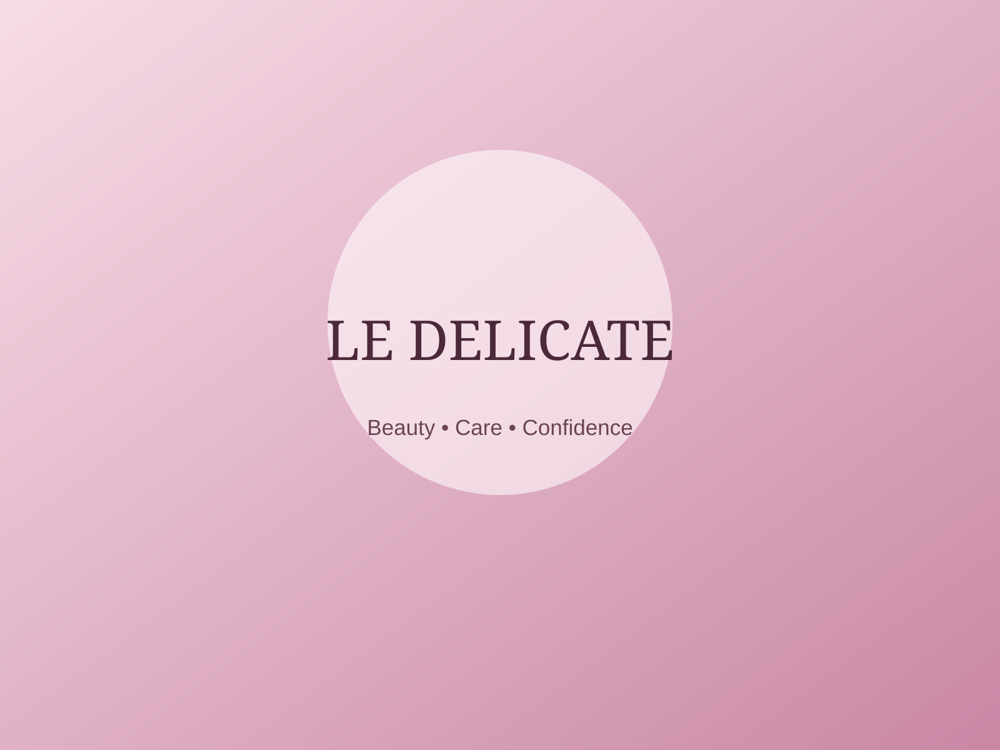

# Le Delicate Website – Part 2

## Student
- **Name:** Katlego Mohlaka
- **Student Number:** ST10525436
- **Subject:** WEDE5020
- **Project:** Le Delicate Beauty Services and Training Website

## Project Overview

Le Delicate is a proposed/fictional beauty services and training organisation created for the WEDE5020 website project.

Part 1 established the website structure, content, navigation, sitemap and basic HTML foundation. Part 2 develops that foundation into a more complete desktop and responsive website through external CSS, visual styling, responsive layouts, interactive states and responsive image techniques.

The website remains an academic prototype. Contact details, prices, locations and training information are therefore presented as proposed information and should be confirmed if the project is later adapted for a real organisation.

## Part 2 Objectives

The main objectives for Part 2 were to:

- improve the website based on the Part 1 foundation;
- establish a consistent visual identity;
- create and use an external stylesheet;
- apply a clear base typography and spacing system;
- develop a desktop layout;
- introduce hover, focus and active states;
- create responsive layouts for desktop, tablet and mobile screens;
- use relative CSS units such as `rem`, `em` and `%`;
- use responsive image markup with `srcset`, `sizes` and `<picture>`;
- keep content as the main focus of each page;
- improve accessibility through semantic HTML, labels, alternative text and visible keyboard focus states;
- document the work clearly in GitHub.

## Website Pages

- `index.html` – Home
- `about.html` – About Us
- `services.html` – Beauty Services
- `classes.html` – Beauty Classes
- `enquiry.html` – Enquiry / Booking
- `contact.html` – Contact

## Folder Structure

```text
Le-Delicate-Website/
├── index.html
├── about.html
├── services.html
├── classes.html
├── enquiry.html
├── contact.html
├── README.md
├── css/
│   └── style.css
├── js/
│   └── script.js
├── images/
│   ├── hero-640.svg
│   ├── hero-1024.svg
│   ├── hero-1600.svg
│   ├── nails-640.svg
│   ├── nails-1024.svg
│   ├── nails-1600.svg
│   ├── lashes-640.svg
│   ├── lashes-1024.svg
│   ├── lashes-1600.svg
│   ├── hair-640.svg
│   ├── hair-1024.svg
│   ├── hair-1600.svg
│   ├── classes-640.svg
│   ├── classes-1024.svg
│   ├── classes-1600.svg
│   ├── about-640.svg
│   ├── about-1024.svg
│   └── about-1600.svg
└── documents/
    └── references/
```

## Part 1 Improvements

The original Part 1 repository provided the required page structure and basic navigation. During the Part 2 review, the following improvements were made to strengthen the foundation before applying the new styling:

1. Reworked page copy to sound more natural and user-focused rather than relying on repeated generic phrases.
2. Improved headings and calls to action so visitors can understand the purpose of each section more quickly.
3. Added clearer service descriptions and separated the service categories into focused sections.
4. Improved the enquiry form labels and wording.
5. Added clearer prototype notes so proposed information is not presented as confirmed real-world business information.
6. Improved accessibility details including descriptive image alternative text, navigation labels and visible focus states.
7. Replaced visual placeholder boxes with locally stored responsive image assets so the pages have a more complete presentation.
8. Kept the six-page structure from Part 1 while improving the consistency of the content and navigation.

> **Note:** The lecturer's individual Part 1 marking comments were not available while this Part 2 version was prepared. The changes above therefore document practical improvements made during the Part 2 review rather than claiming specific lecturer comments that were not supplied.

## CSS Implementation

The website now uses one external stylesheet:

`css/style.css`

The stylesheet establishes:

- a consistent colour palette;
- base font family, font size, weight, line height and letter spacing;
- reusable container and button styles;
- responsive card grids;
- hero and page-banner layouts;
- form styling;
- footer styling;
- borders and box shadows;
- hover effects;
- focus-visible states;
- active navigation states;
- responsive image presentation;
- reduced-motion support.

### Relative units

The CSS uses relative units such as:

- `rem` for typography and spacing;
- `em` where suitable for component sizing;
- `%` for fluid widths;
- `clamp()` for flexible heading and section sizing;
- viewport-based values where they improve responsiveness.

## Responsive Design

Three practical viewport ranges were considered:

### Desktop
**Above 992px**

The desktop layout uses multiple columns where appropriate. The home page uses a two-column hero, service cards are displayed in multiple columns, and the footer uses a multi-column structure.

### Tablet
**Between 673px and 992px**

The layout reduces the number of columns and allows major sections to stack when necessary. Navigation remains available while content becomes more fluid.

### Mobile
**Up to 672px**

Content changes to a single-column layout. Typography is reduced using responsive sizing, navigation wraps across available space, forms become single-column, and cards stack vertically.

## Responsive Images

The website uses `<picture>`, `srcset` and `sizes` for the main visual assets.

Example:

```html
<picture>
  <source media="(max-width: 42rem)" srcset="images/hero-640.svg">
  <source media="(max-width: 62rem)" srcset="images/hero-1024.svg">
  
</picture>
```

This allows the browser to select a more suitable asset based on the viewport and display size.

## Interaction and Accessibility

Interactive elements include:

- navigation hover states;
- active navigation states;
- button hover and active states;
- visible keyboard focus states;
- form input focus states;
- a back-to-top button;
- basic front-end form feedback.

The form remains a prototype and does not connect to a real booking or email service.

## Testing

The website should be tested using browser developer tools at a minimum of:

- Desktop: 1440px × 900px
- Tablet: 768px × 1024px
- Mobile: 390px × 844px

### Evidence to add before final submission

Take screenshots after opening each important page in the browser at desktop, tablet and mobile sizes. Add them to the repository in a folder such as:

```text
documents/
└── screenshots/
    ├── desktop-home.png
    ├── desktop-services.png
    ├── tablet-home.png
    ├── tablet-services.png
    ├── mobile-home.png
    └── mobile-services.png
```

The screenshots should show the browser/device dimensions where possible so the lecturer can clearly see the responsive behaviour.

### Testing checklist

- [ ] Desktop navigation displays correctly.
- [ ] Desktop hero and cards use multiple columns.
- [ ] Tablet layout reduces columns without horizontal scrolling.
- [ ] Mobile layout stacks content into one column.
- [ ] Images remain inside their containers.
- [ ] Buttons remain readable and usable.
- [ ] Form controls fit the viewport.
- [ ] Keyboard focus is visible.
- [ ] Navigation links work on every page.
- [ ] Service anchor links open the correct sections.
- [ ] No horizontal scrolling occurs at mobile width.
- [ ] Back-to-top control works after scrolling.

## Changelog

### Part 2 – Content and Part 1 Improvements

- Reviewed the original Part 1 page content and rewrote several sections in a more natural, conversational and customer-focused tone.
- Improved headings so that each section communicates its purpose more clearly.
- Reworked service descriptions to avoid repetitive wording and make the differences between service categories easier to understand.
- Improved calls to action such as “Make an enquiry”, “Explore classes” and “Register interest” so visitors have a clearer next step.
- Updated the enquiry page wording to make it clear that the form is an academic front-end prototype.
- Added proposed-information notes where business details should not be interpreted as confirmed real-world information.
- Replaced the basic visual placeholders with locally stored image assets and responsive image markup.
- Improved accessibility by adding descriptive `alt` text, navigation labels, form labels and visible keyboard focus states.
- Added an active state to the main navigation so the current page is easier to identify.
- Added a back-to-top control to improve navigation on longer pages.

### Part 2 – CSS and Responsive Design

- Created and applied a central external stylesheet at `css/style.css`.
- Added a consistent colour palette using CSS custom properties.
- Added a base typography system covering font family, font size, font weight, line height and letter spacing.
- Created reusable styles for containers, buttons, cards, sections, forms, banners and the footer.
- Added border, background, shadow and radius treatments to establish a consistent visual language.
- Added `:hover`, `:focus-visible` and `:active` states for interactive elements.
- Added a desktop two-column hero layout and multi-column card layouts.
- Added tablet media-query behaviour to reduce columns and stack larger sections where required.
- Added mobile media-query behaviour to create single-column layouts and adjust navigation, typography and form controls.
- Used relative units such as `rem`, `%` and `clamp()` to improve responsiveness.
- Added responsive image handling with `<picture>`, `srcset` and `sizes`.
- Added reduced-motion support for users who prefer less animation.
- Added basic JavaScript for active navigation, back-to-top behaviour and front-end enquiry feedback.

## Submission

The Part 2 submission should contain:

1. All updated HTML files.
2. The external CSS stylesheet.
3. Supporting JavaScript and image assets.
4. Updated README documentation.
5. Detailed changelog entries.
6. Responsive testing screenshots.
7. The GitHub repository link submitted through the learning management system.

## GitHub

Repository:

https://github.com/Katlego86/Le-Delicate-Website

Suggested Part 2 commit message:

```text
Complete Part 2 responsive styling and documentation
```

## References

- S. Sasti and D. Sasti, *Principal Computer Programming*, Macmillan Education South Africa.
- Arihant, *Computer Operator & Programming Assistant, NSQF 3, NIMI Pattern*.
- Andy Vickler, *Web Development for Beginners*.

## Academic Content Note

Le Delicate is treated as a proposed/fictional organisation for this assignment. Addresses, telephone numbers, email addresses, prices, course information and service details are illustrative and should be replaced or confirmed if actual client information becomes available.
